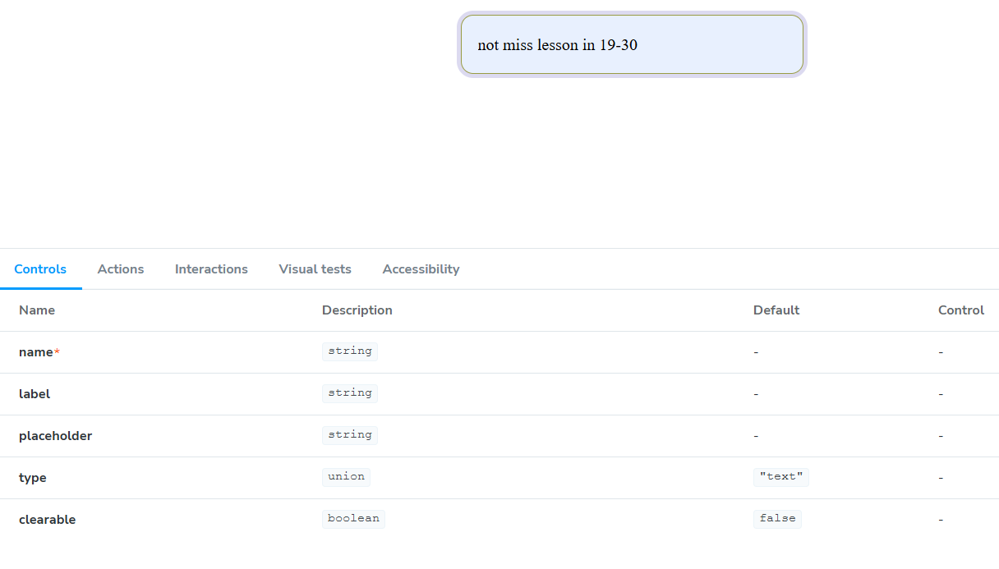
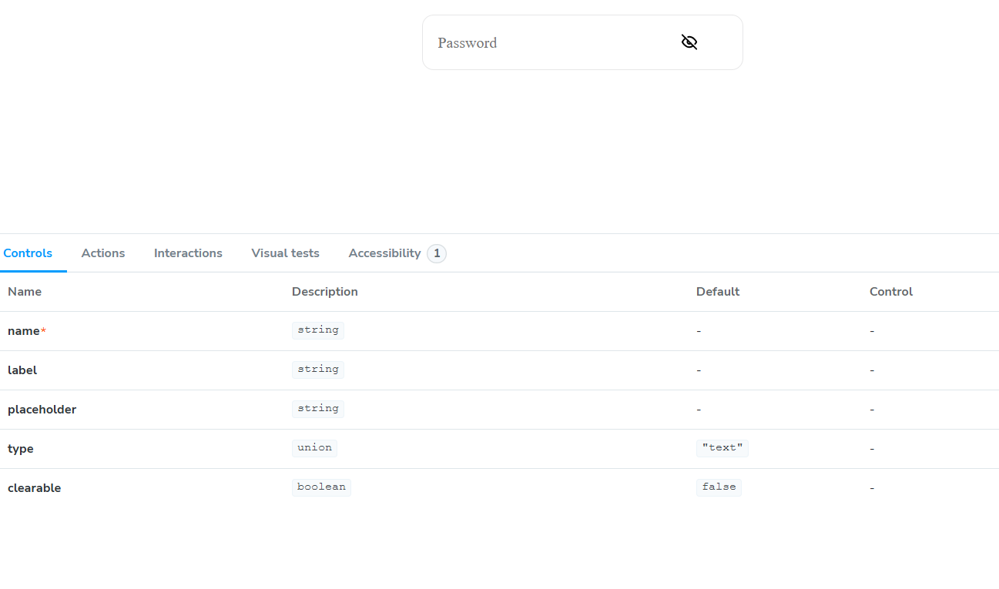
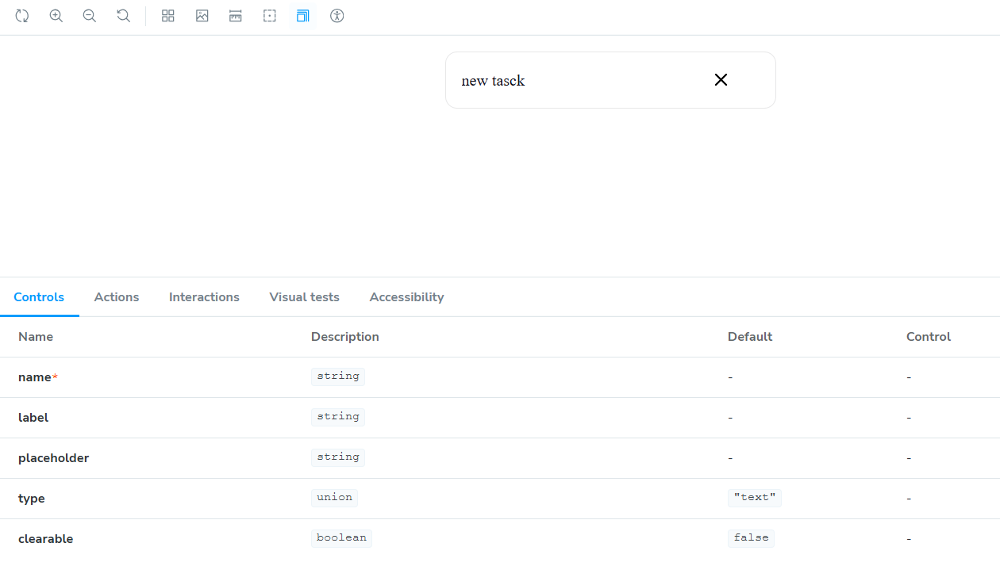
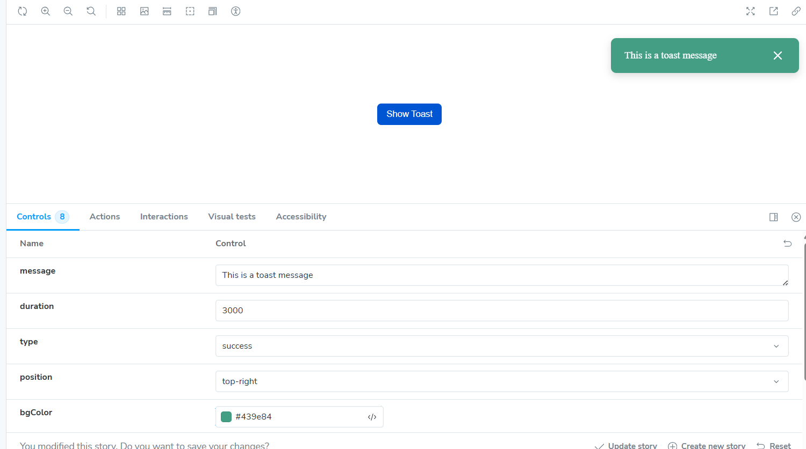
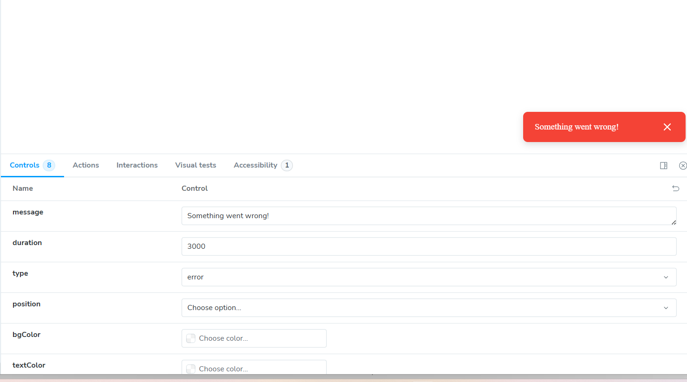
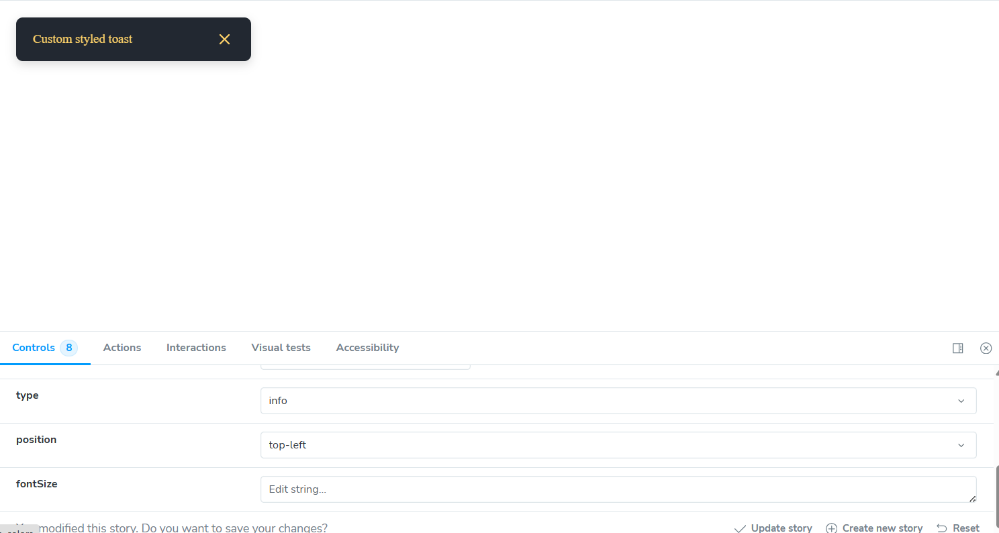
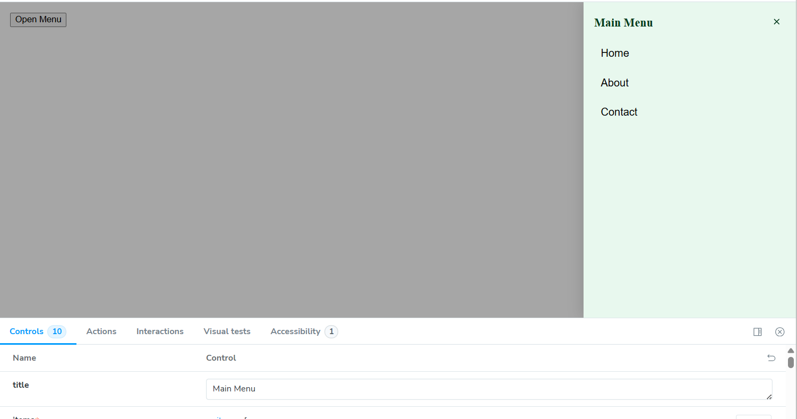
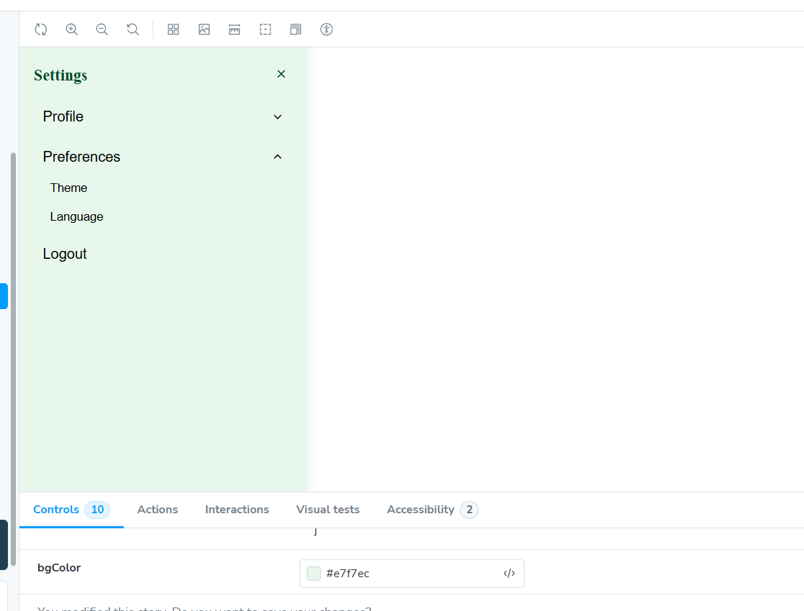
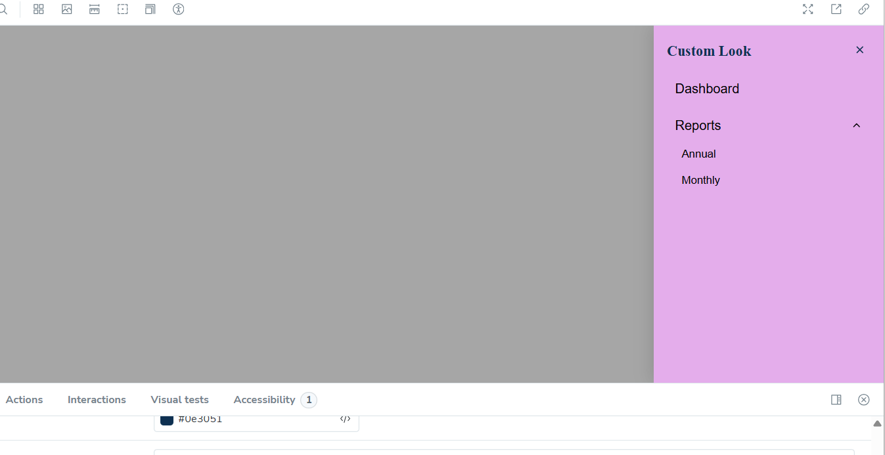

# 🌈 Storybook UI Component System

A custom UI component library built with **React + TypeScript + Storybook**.  
Includes reusable, interactive, and styled components — Input, Toast, and Sidebar Menu.

## 🚀 Setup Instructions

1. Clone the repo:

```bash
      git clone https://github.com/LiudmylaTar/Storybook-based-UI.git
```

2. Install dependencies:

```bash
    npm install
```

3. Run Storybook:

```bash
    npm run storybook
```

## 🧩 Components Overview

📥 Input

Supports text, password, number
Password visibility toggle 👁️
Clearable input ❌
Integrated with react-hook-form

## 🖼️ Screenshots

| Variant   | Screenshot                                                   |
| --------- | ------------------------------------------------------------ |
| Text      |            |
| Password  |    |
| Clearable |  |

🔔 Toast

Auto-dismiss and manual close
Positions: top/bottom + left/center/right
Variants: info, success, error, warning
Custom colors and duration
Smooth fade animation

## 🖼️ Screenshots

| Type    | Screenshot                                               |
| ------- | -------------------------------------------------------- |
| Success |  |
| Error   |      |
| Warning |   |

### Sidebar Menu

📚 Sidebar Menu

Multi-level nested structure
Sliding animation (overlay / push)
Configurable position (left/right)
Customizable colors, font size, and width
Click background to close

## 🖼️ Screenshots

| Mode          | Screenshot                                                  |
| ------------- | ----------------------------------------------------------- |
| One Level     |     |
| Two Level     |          |
| Left Position |  |

## 🧰 Tech Stack

React + TypeScript
Storybook
React Hook Form
CSS Modules
(Optional) Framer Motion for animations
